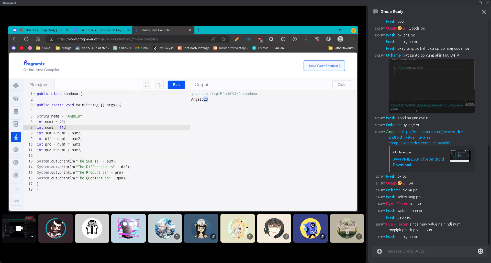
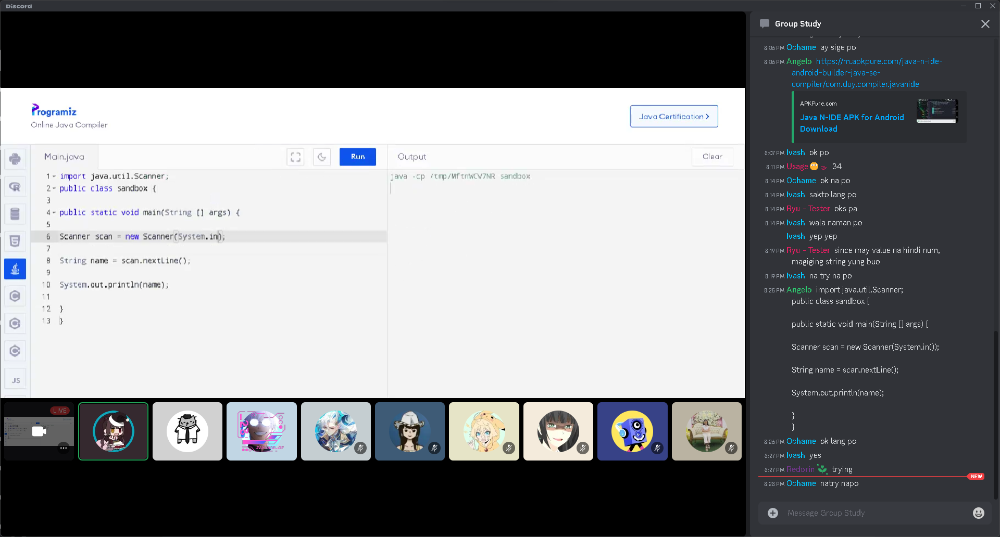
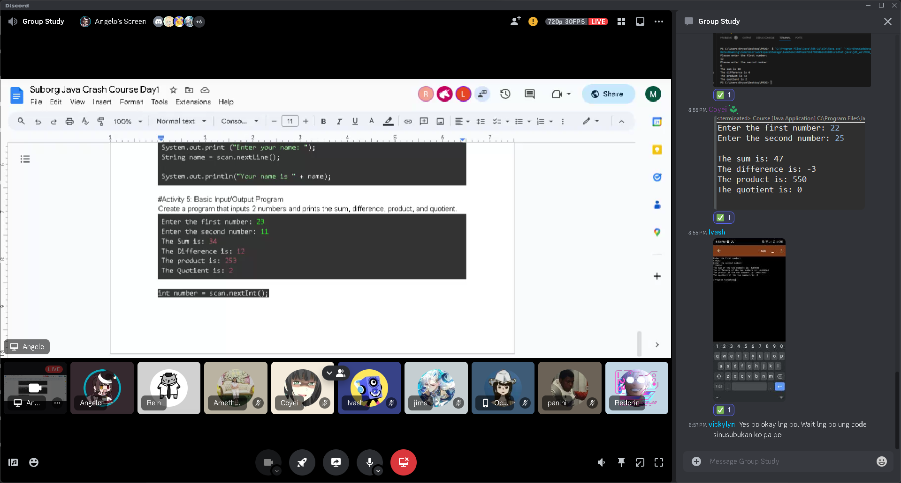

# Java Crash Course (10-28-23) 
#### By Programming Sub Organization
[Day 1 Syllabus](https://docs.google.com/document/d/1LT9-Q6RxquKt-OihYsSJ3K5xCXis3wABxGa_k1nIWiY/edit)
#### Summary of session 📝:
- [Java Setup for Visual Studio Code](https://youtu.be/BB0gZFpukJU?si=r2gt4SdbOwdCRIEg)
- [Printing in Console](HelloWorld.java)
- [Declaration of Variables](Variables.java)
- [Printing of Variables](Variables.java)
- [Arithmetic Operations](Arithmethic.java)
- [String input using Scanner](NameInput.java)
- [Basic Calculator using Scanner](Calculator.java)

#### Additional Resources 📖:
- [Setting Up VSCode for Java](https://youtu.be/BB0gZFpukJU?si=wpFZcG9qW8yUDlhJ)
- [Setting Up Eclipse for Java](https://youtu.be/NBIUbTddde4?si=ku4Vgp37kCbaNYO-)
- [Bro Code Variables](https://youtu.be/so1iUWaLmKA?si=dlfNEjgerFecE76p)
- [Arithmetic Operations](https://youtu.be/pZHJU9T0vwE?si=SGJEepXl7dy54Yw-)
- [Using Scanner Class](https://youtu.be/wAEPokhj5Q4?si=ZuKSdMtFITiZAZfJ)

#### Screenshots 📷:

