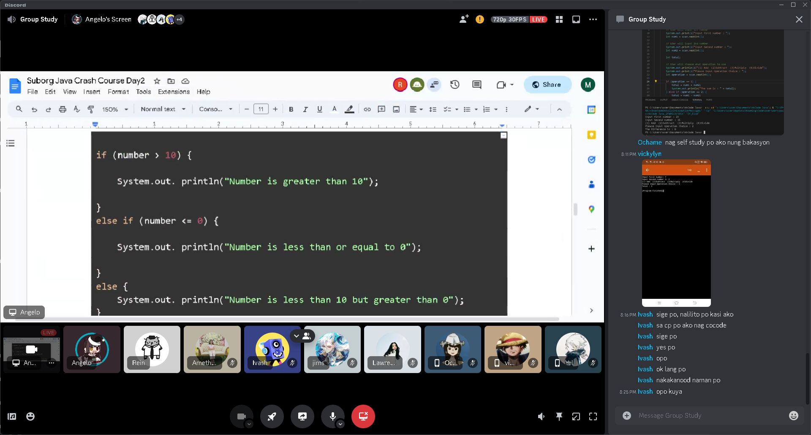
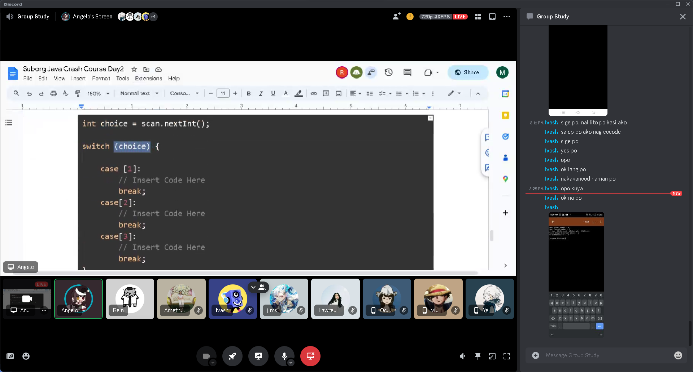
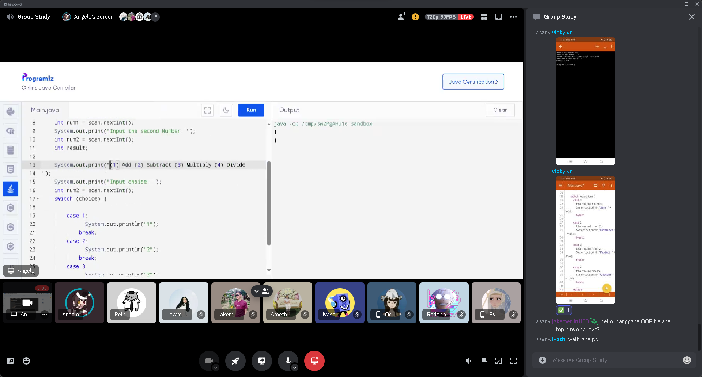

# Java Crash Course (10-29-23) 
#### By Programming Sub Organization
[Day 2 Syllabus](https://docs.google.com/document/d/1HtE21V7Y7ynNTMfBhx3JnQNjPMR0z8H2PbYYXnSfX8Y/edit)
#### Summary of session 📝:
- [If Else](IfElse.java)
- [Equals Method for Strings](EqualsMethod.java)
- [Else If](ElseIf.java)
- [Else If With Operations](ElseIfOperations.java)
- [Calculator With If Else Statements](CalculatorChoice.java)
- [Calculator in a Switch Case Format](CalculatorSwitchCase.java)

#### Additional Resources 📖:
- [If, Else If, and Else Statements](https://youtu.be/MY03bt_0JQI?si=8TwyiKgsSWBrdw5m)
- [Switch Case Statements](https://youtu.be/Om3qzMoaIUo?si=k2y68WZgFT7Qd4Sk)

#### Screenshots 📷:

