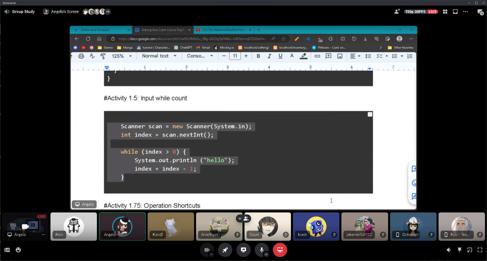
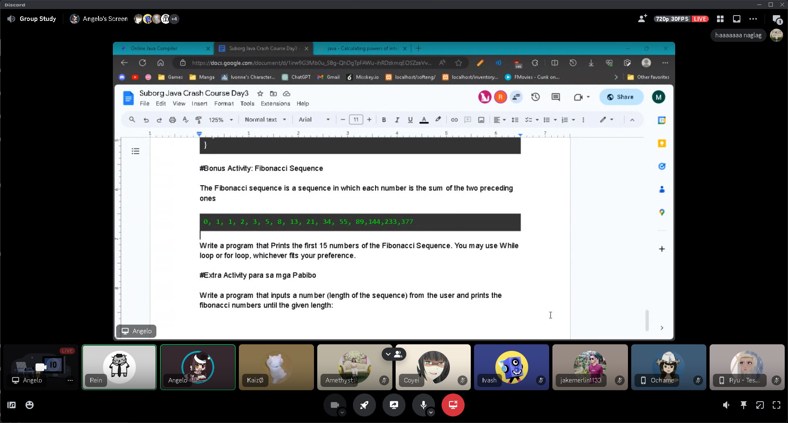
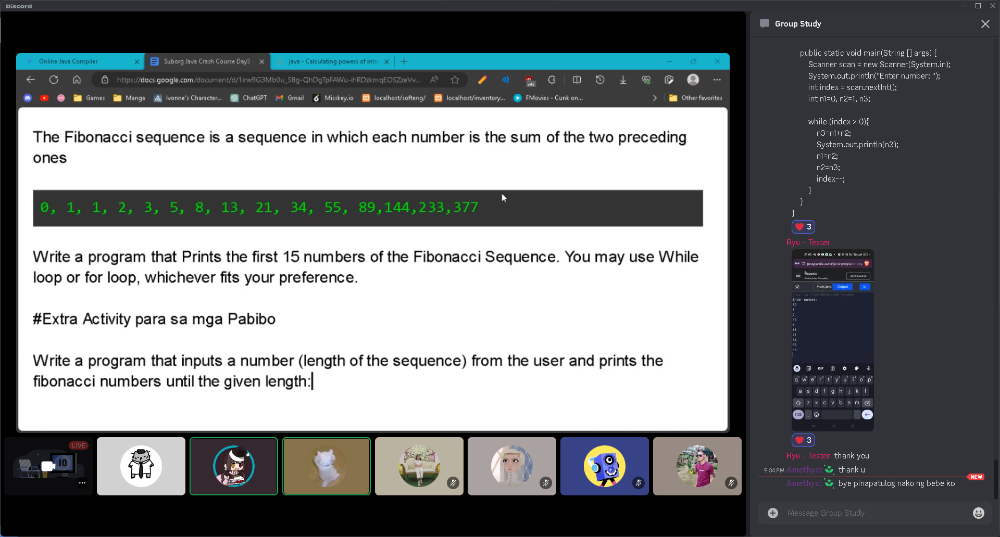

# Java Crash Course (10-31-23) 
#### By Programming Sub Organization
[Day 3 Syllabus](https://docs.google.com/document/d/1irw9G3Mb0u_S8g-QhDgTpFAWu-ihRDzkmqEOSZzeVvE/edit?usp=sharing)
#### Summary of session 📝:
- [While Loop](WhileLoop.java)
- [Input While Loop](InputWhile.java)
- [Decreasing While Loop](DecreasingNum.java)
- [Square While Loop](SquareNum.java)
- [For Loop](ForLoop.java)
- [Fibonacci Sequence Activity](FibonacciSequence.java)
- [Fibonacci Sequence Extra Challenge](FibonacciSequenceChallenge.java)

#### Additional Resources 📖:
- [While Loop](https://youtu.be/t6gmQaTMTtM?si=EhlXqjSol9LwkTlc)
- [For Loop](https://youtu.be/Rn16ugyorX0?si=jaMPbH8zI0jeMhO0)

#### Screenshots 📷:

