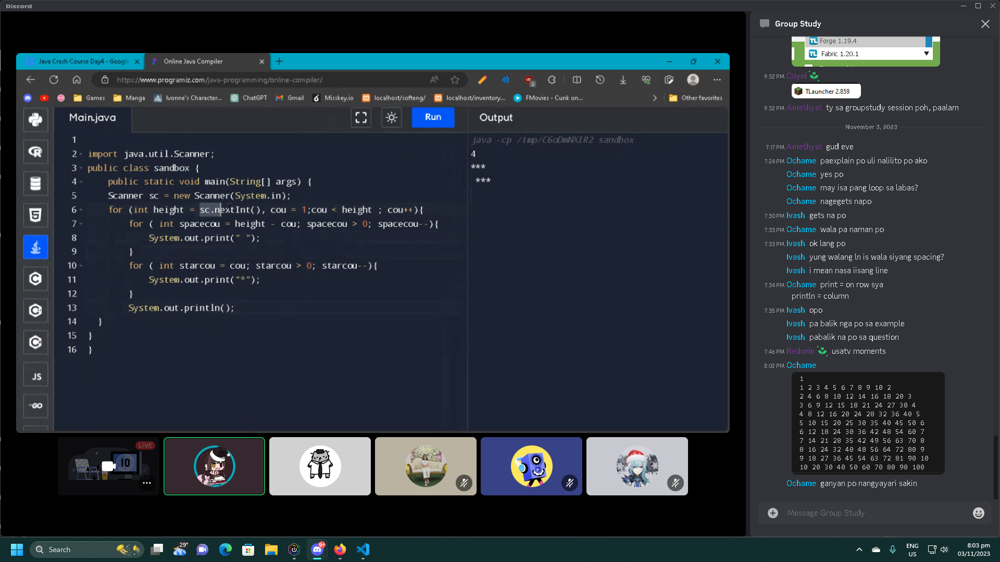
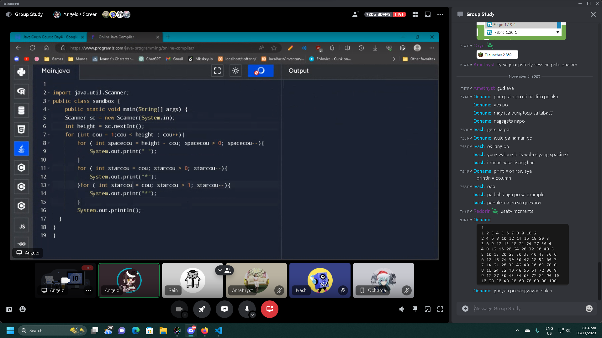

# Java Crash Course (10-31-23) 
#### By Programming Sub Organization
[Day 4 Syllabus](https://docs.google.com/document/d/1aKLHVzNsiYZnZHEMmO2th54PgNuBCiotLbNdNfHCJfQ/edit)
#### Summary of session 📝:
- [Nested While Loop](NestedWhileLoop.java)
- [Multiplication Table](MultiplicationTable.java)
- [Triangle Challenge](Triangle.java)

#### Additional Resources 📖:
- [Nested While Loop](https://youtu.be/oF3nBQFfpeM?si=nmlJzb6w2kRfq_hw)

#### Screenshots 📷:

