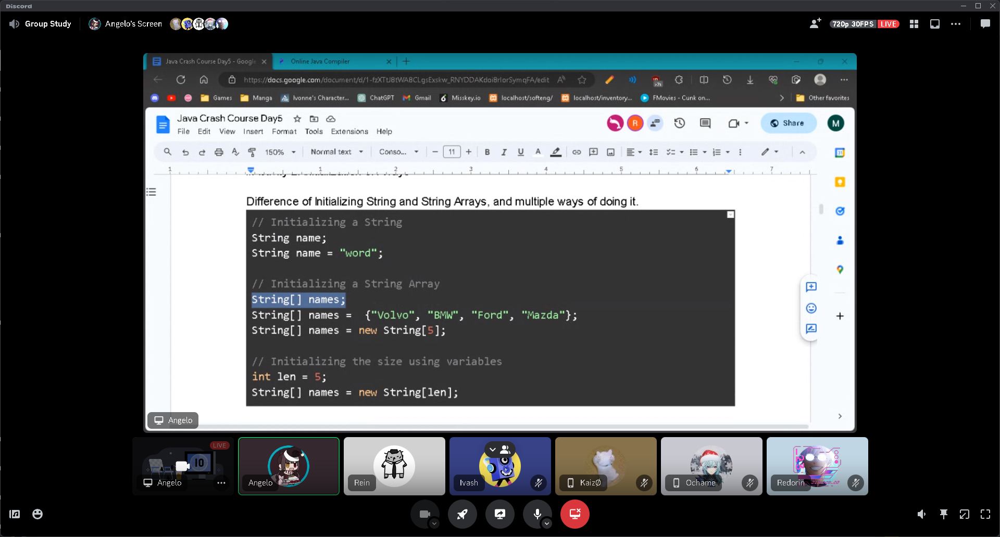
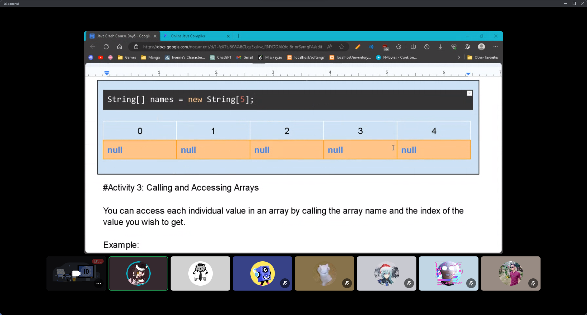
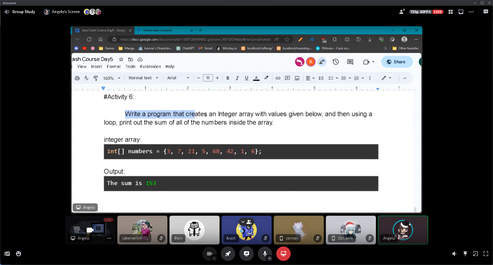

# Java Crash Course (10-31-23) 
#### By Programming Sub Organization
[Day 5 Syllabus](https://docs.google.com/document/d/1-fzXTtJ8tWA8CLgsExskw_RNYDDAKdoi8rIorSymqFA/edit)
#### Summary of session 📝:
- [String Arrays](StringArrays.java)
- [Integer Arrays](IntegerArrays.java)
- [Printing String Arrays](PrintingStringArrays.java)
- [Sum of Integer Array Elements](PrintingSumArrays.java)
- [Average of Integer Array Elements](AverageOfArrayElements.java)
- [Checking Element in Array](ElementInArray.java)

#### Additional Resources 📖:
- [Java Arrays](https://youtu.be/ei_4Nt7XWOw?si=Wba_5CAN4b-Kz20-)

#### Screenshots 📷:

